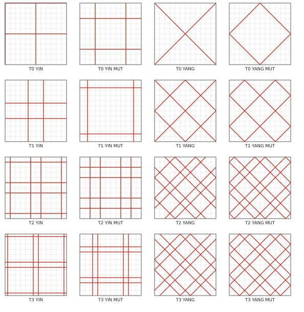
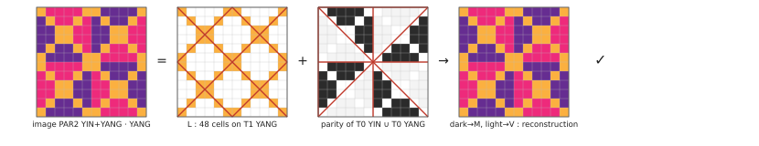
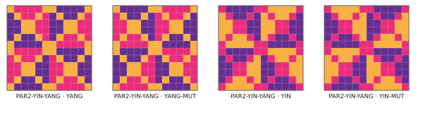
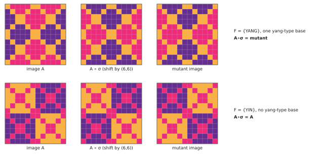
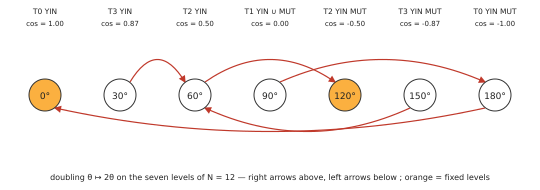

# Abstract

A Jacquard pattern system has been described in three separate ways: as
sixteen families of straight axes on a $12\times12$ square combined by a
parity rule; as sixty three-tint images from which $512$ grids are built by a
six-bit selection; and as level sets of a square-plate eigenmode. The images
were generated and classified before the axes were formalised. We show, by
exhaustive check on the published data and not by sampling, that the three
descriptions present one finite structure, in a sense made precise in §1.

The central statement is that **every one of the sixty images is a parity
figure of axes**: forty-eight cells of *lines*, the same for all sixty and equal
to the nodal set of the degenerate guided plate mode $\cos(4\pi x/a)-\cos(4\pi y/a)$;
ninety-six cells carrying the parity of a union of the four families of level
$T_0$; and one of four tint permutations, which are the four *natures* of the
system. The four $T_0$ families are a basis of a space $\mathbb F_2^4$ that the
parity map embeds injectively, so the fifteen families of the loom are its
fifteen non-zero vectors, and the involutions previously observed between
natures are now their definition. The half-shift is then a linear form on
$\mathbb F_2^4$, and the half-shift theorem of the companion note on grids —
exactly eight families of fifteen admit unified pairs — is the count
$2^4-2^3$ of vectors off its kernel.

Two further results fix the status of the construction. The code spanned by
the sixteen families is a $[1152,13]$ binary code of minimum distance $288$:
the integrity check that located two corrupt plates is a linear code that
detects $287$ wrong regions and corrects $143$. And, on levels, the doubling
homothety that organises the families into generations terminates without
cycles if and only if the period is $2^a$ or $3\cdot 2^a$, and has a
non-trivial fixed level if and only if $3$ divides the period: $12$ is the
smallest period meeting both criteria with at least two generations.

Nothing here is measured on a plate; the plate statements are exact for
guided edges only, and the one interferometric prediction is recalled from
the companion note, not used. All scripts and data are public.

---

# 1. Three corpora

The system in question was designed by hand, over several years, as a grammar
of woven patterns. It has been formalised in three notes, each verified region
by region against the published vector drawings.

**The axes** [A]. Sixteen families of straight lines — horizontal, vertical,
and the two diagonal directions — on a $12\times12$ square, indexed by a level
$T_0,\dots,T_3$ and a name among YIN, YIN MUT, YANG, YANG MUT. A subset of
families, called a *chord*, produces a two-colour figure by a parity rule. The
construction is reversible, the reading cell is a parameter, the families are
closed under the doubling homothety, and the figures carry an integrity check.

**The images and the grids** [G]. Sixty three-tint $12\times12$ images,
organised as fifteen families of four natures, from which $1024$ constructions
$\Phi(n,A,B)$ give $512$ distinct grids under a six-bit selection. A half-shift
criterion — translating a grid by half its period reproduces the exchange of
its two layers — selects eight families of fifteen; the edge rule of a cube
retains four; a trichotomy governs the crossed pairs.

**The plate** [P]. The sixteen axis families are level sets of the single
function $\varphi(x)=\cos(\pi x/3)$ at the seven angles $0^\circ,30^\circ,
\dots,180^\circ$; the mutation is the reflection $\theta\mapsto180^\circ-\theta$;
$\varphi$ is an exact eigenfunction of the square Kirchhoff plate with guided
edges, and the degenerate combinations $\cos(4\pi x/a)\pm\cos(4\pi y/a)$ have
for nodal sets two of the diagonal families.

**Independence of the corpora.** The identification below is not a
consequence of a common formalisation. The notes were written in the order
[G], [A], [P]: the sixty images of [G] were generated, and classified into
fifteen families and four natures, before the axis catalogue of [A] existed,
and [G] makes no use of axes. The axes were extracted afterwards from the
plates of the treatise [5], not from the images. Both corpora descend from the
same treatise, so a common origin is not excluded — it is what the paper
explains; what is excluded is that the conventions used to build one corpus
were chosen to fit the other. The question this paper answers is whether [G]
can be derived from [A]. It can, and the derivation passes through [P].

**What "one object" means.** By *one object* we mean this, and no more: a
single finite structure — the $48$-cell set $L$ of §2, the space
$\mathbb F_2^4$ of chords of the four $T_0$ families, and four tint
permutations — of which each corpus is a presentation, region by region, on
the published data. The claim is about finite, published data. Accordingly
Theorem 1 is labelled a *finite-corpus identification*: its proof is an
exhaustive check, and it says nothing about images that were not drawn.
Theorem 2 is a finite computation on the $72$ band systems; Theorem 3 and the
Lemma of §3 are proved by argument. §8 sorts every statement by status.

**Place of this paper.** The system has an origin, a structure, and three
extensions, each with its own note, and this paper is the second. The ansate
cross [C] is the origin: a cross-shaped constraint system that fills the
order-$6$ squares from which the treatise's patterns descend. This paper
describes the structure common to the three corpora. [G] asks whether that
structure closes on a cube; [P] reads the same lines as level sets of a plate
mode; [K] uses the resulting finite vocabulary as the referent of an encoding.
Each of them depends on this paper only through Theorem 1, and none is
repeated here.

We fix conventions once. The square is $[0,12]^2$ divided into $144$ unit
cells; $C_1$ is that subdivision, $C_8$ cuts each cell by its two diagonals and
two medians into eight triangles, $1152$ in all. An axis is a line of one of
four *natures* — H, V, D$^+$ ($x+y$ constant), D$^-$ ($y-x$ constant) —
given by its signed offset $e$ from the centre, in cells; diagonal offsets are
$(x+y-12)/2$ and $(y-x)/2$. The generating objects are not the drawn segments
but the **band systems**, or *keys*: an orthogonal key is a nature and an offset
$e\in(-6,6]$, of period $12$; a diagonal key is a nature and an offset taken
modulo $6$, since a lattice translation by $(12,0)$ shifts the diagonal
coordinate by $6$, and it is drawn on the square as the two parallel segments
$e$ and $e\pm6$. There are $72$ keys — $24$ per orthogonal nature, $12$ per
diagonal nature — and the sixteen families are sets of keys, each key counted
once. The **parity figure** of a set of keys on a subdivision $\mathcal C$
colours a region dark according to the parity of the number of lines of the
systems that separate its centroid from a fixed reference point, taken just
inside the corner at the origin (the scripts use $(0.01,\,0.01)$); since no
figure is identified with its complement, this point fixes every weight quoted
below. We write $\Pi_{\mathcal C}(A)$. No identification of a
figure with its colour exchange is made: on $C_8$ the all-dark figure is not
in the span of the keys, so the exchange is not available, and on $C_1$ it is,
which is a relation and not a convention. Under this rule the sixteen families reproduce the
published plates region by region [A]; the inventory of *drawn segments* is
$94$, of which $30$ lie in two families, but it is not the generating set, and
counting it as one would double the two diagonal lines of $T_0$ YANG MUT and
annul them.



*Figure 1. The sixteen families of axes, as drawn on the square: orthogonal (YIN) on the left, diagonal (YANG) on the right, levels T0 to T3 from top to bottom. The edge lines of T0 YIN coincide with the border.*

For a chord, $A$ is the *union* of the keys of its families; for the linear
algebra of §5 we use the symmetric difference, under which a key present in
two families cancels. The two semantics agree on all chords of $T_0$ families,
whose key sets are pairwise disjoint.

---

# 2. The images are parity figures

Let $L$ be the set of cells whose centre lies on an axis of $T_1$ YANG, that
is, on one of the six diagonal lines of offset $0$ or $\pm3$ in either sense.
$L$ has $48$ cells. Let $\mathcal B=\{T_0\,\mathrm{YANG},\,T_0\,\mathrm{YANG\ MUT},
\,T_0\,\mathrm{YIN},\,T_0\,\mathrm{YIN\ MUT}\}$; its four members are pairwise
disjoint sets of axes.

**Theorem 1 (finite-corpus identification).** *Every one of the sixty
published images of [G] is of the form*

$$
I \;=\; \big(L,\ \Pi_{C_1}(F),\ \tau\big),
$$

*where $F$ is a non-empty subset of $\mathcal B$, the $48$ cells of $L$ carry
one tint, the $96$ cells off $L$ carry the two-colour figure $\Pi_{C_1}(F)$
in the two other tints, and $\tau$ is one of four tint assignments:*

| nature | cells of $L$ | figure $\Pi(F)$ dark / light |
|---|---|---|
| YANG | O | V / M |
| YANG MUT | O | M / V |
| YIN | M | O / V |
| YIN MUT | M | V / O |

*The correspondence $F\leftrightarrow$ family is a bijection between the
fifteen non-empty subsets of $\mathcal B$ and the fifteen families of the loom:
the four BASES families are the singletons, PAR2 the six pairs, PAR3 the four
triples, YINYANG the whole.*

*Proof.* Exhaustive check on the sixty published images, cell by cell, with
no exception (`verif_images_axes.py`). $\square$



*Figure 2. Theorem 1 on one image: the image of family PAR2 YIN+YANG, nature YANG, equals the 48 cells of L in orange, plus the parity figure of T0 YIN ∪ T0 YANG on the other 96 cells, dark to M and light to V; the reconstruction matches cell for cell.*



*Figure 3. The four natures of one family (PAR2 YIN+YANG) are four tint permutations of the same lines-and-parity structure: YANG, YANG MUT (V and M exchanged), YIN (V→O, M→V, O→M), YIN MUT (V and O exchanged).*

Three remarks.

*The natures are tint permutations.* YANG MUT is YANG with V and M
exchanged; YIN MUT is YIN with V and O exchanged; YIN is YANG under the cycle
V$\to$O, M$\to$V, O$\to$M. All three hold on all fifteen families. The first
two are exactly the involutions $\pi$ recorded as fact (F5) in [G] — V$\leftrightarrow$M
fixing O for the pair (yang, yang-mut), V$\leftrightarrow$O fixing M for
(yin, yin-mut). They were observed there; here they are constructed.

*The lines are a plate object.* By Theorem 3 of [P], $L$ is the nodal set
of $\cos(4\pi x/a)-\cos(4\pi y/a)$, the difference of the two degenerate guided
modes $(4,0)$ and $(0,4)$. Every image of the loom therefore carries, in its
third tint, the nodal lines of one plate mode, and in its two other tints the
parity of axes of level $T_0$ — the centre lines and the diamond.

The third remark deserves to be a statement, because the rest of the paper
leans on it. Identify a subset $F\subseteq\mathcal B$ with its indicator
vector in $\mathbb F_2^4$, coordinates in the order YANG, YANG MUT, YIN,
YIN MUT, and let $V_L$ be the space of two-colourings of the $96$ cells off
$L$, with $\mathbf 1$ the all-dark colouring.

**Proposition 1.** *The map $\Phi:\mathbb F_2^4\to V_L$,
$F\mapsto\Pi_{C_1}(F)|_{C_1\setminus L}$, is linear and injective, and its
image meets the line $\{0,\mathbf 1\}$ only in $0$. Hence the fifteen non-zero
chords of $T_0$ give fifteen figures that are pairwise distinct even up to
colour exchange, and the fifteen families of the loom are the fifteen
non-zero vectors of $\mathbb F_2^4$.*

*Proof.* Linearity: the members of $\mathcal B$ are pairwise disjoint sets of
keys, so union and symmetric difference agree and
$\Pi(F\cup F')=\Pi(F)\oplus\Pi(F')$. Injectivity and the second assertion are
a rank computation over $\mathbb F_2$: the four basis figures have rank $4$
on the $96$ cells, and rank $5$ with $\mathbf 1$ adjoined
(`espace_F2_4.py`). $\square$

The count $15=2^4-1$ of families in [G] is thus not an inventory but a
dimension, and the four natures act on a fixed image of $\Phi$ by tint
permutation only.

---

# 3. The half-shift theorem, derived

[G] builds grids from two images $A$, $B$ of one family by a six-bit word $n$
selecting, level by level of a fixed map, which image supplies each cell, and
calls a pair *unified* when $B=A\circ\sigma$, $\sigma$ the translation by
$(6,6)$ modulo $12$. Its Theorem 2 states that unified pairs exist in exactly
eight families of fifteen, those containing exactly one base of yang type,
and that the pair is then (yang, yang-mut) or (yin, yin-mut).

With Theorem 1 this is a statement about three sets of lines.

**Lemma.** *On the torus, $\sigma$ maps each of the five axis sets $L$,
$T_0$ YANG, $T_0$ YANG MUT, $T_0$ YIN, $T_0$ YIN MUT to itself. Consequently,
for every $F\in\mathbb F_2^4$,*

$$
\Pi(F)\circ\sigma \;=\; \Pi(F)\;\oplus\;\varepsilon(F)\,\mathbf 1,
\qquad
\varepsilon(F)=F_{\mathrm{YANG}}+F_{\mathrm{YANG\ MUT}}\pmod 2,
$$

*so that $\sigma$ acts on figures through the linear form
$\varepsilon:\mathbb F_2^4\to\mathbb F_2$, equal to $1$ on the two yang-type
basis vectors and $0$ on the two yin-type ones.*

*Proof.* $L$ is the set of lines $x+y\in\{6,12,18\}$ and $x-y\in\{0,\pm6\}$,
invariant under $(x,y)\mapsto(x+6,y+6)$ modulo $12$. The same holds for the
centre cross $\{x=6,\,y=6\}$, the diagonals $\{x=y,\,x+y=12\}$, the square
$\{x,y\in\{3,9\}\}$ and the diamond $|x-6|+|y-6|=6$. A parity figure is, up to
complement, the unique two-colouring whose colour changes exactly across the
lines of its axis set; so $\Pi(F)\circ\sigma$ is $\Pi(F)$ or its complement,
and one point decides which. For $T_0$ YIN the quadrant checkerboard is
invariant; for $T_0$ YIN MUT the centre and the corner are both
"inside-inside" or "outside-outside" and have the same colour; for
$T_0$ YANG the top wedge is sent to the left wedge, of opposite colour; for
$T_0$ YANG MUT the centre, inside the diamond, is sent to the corner, outside.
So $\varepsilon$ takes the stated values on the basis, and it is linear
because $\Pi$ is (Proposition 1) and $\sigma$ commutes with $\oplus$.
$\square$

**Corollary (Theorem 2 of [G]).** *Since the mutant of yang is yang with the
figure complemented and the lines fixed, $I(F,\mathrm{yang})\circ\sigma=
I(F,\mathrm{yang\ mut})$ if and only if $F$ has exactly one yang-type member;
otherwise $I(F,\mathrm{yang})\circ\sigma=I(F,\mathrm{yang})$. The same holds
for yin. The unified families are therefore the vectors with
$\varepsilon(F)=1$, the complement of the hyperplane $\ker\varepsilon$:
there are $2^4-2^3=8$ of them, namely $\{\mathrm{Y}\}$, $\{\mathrm{YM}\}$ and
their unions with any subset of the two yin-type bases; the $2^3-1=7$
non-zero vectors of $\ker\varepsilon$ are the invariant families.*

Verified on the data: for the eight families the yang image translated by
$(6,6)$ is the yang-mut image, cell for cell, and the yin image is the yin-mut
image; for the seven others each image is invariant (`demi_decalage.py`,
and `espace_F2_4.py` for the identity on all fifteen $F$). This is the whole
content of Theorem 2 of [G], which was obtained there by enumeration of $1024$
constructions; the numbers $8$ and $7$ are now a hyperplane and its
complement.



*Figure 4. The Corollary of §3 on two families. Top, F = {YANG}: translating the yang image by (6,6) gives the yang-mut image. Bottom, F = {YIN}: the same translation leaves the image invariant.*

The edge rule on the cube (Theorem 3 of [G]: a grid dresses the six faces if
and only if its family contains the base yang, four families of eight) and the
trichotomy on crossed pairs (Theorem 4) remain, at the time of writing,
results verified by exhaustive search. Theorem 1 makes them statements about
which of the two centre figures — the diagonals through the centre, or the
diamond — accompanies $L$; we have not derived them and do not claim to.

---

# 4. The plate reading, in the form needed

We recall from [P] only what is used. The eight orthogonal families are the
complete level sets of $\varphi(x)=\cos(\pi x/3)$ at
$\theta=0^\circ,30^\circ,\dots,180^\circ$, read as positions $p=6+e$, the
level $90^\circ$ being split into $T_1$ YIN and $T_1$ YIN MUT; the eight
diagonal families are level sets of the same function in the diagonal
coordinate — as band systems all eight are complete, $T_2$ YANG and $T_3$
YANG MUT being the same level pair, as are $T_3$ YANG and $T_2$ YANG MUT
(§5); the mutation is $\theta\mapsto180^\circ-\theta$.

*Exact, in the guided model.* $\varphi$ is an exact eigenfunction of the
square Kirchhoff plate with all four edges guided (zero slope, zero shear),
the mode $(4,0)$, and the degenerate combinations
$\cos(4\pi x/a)\pm\cos(4\pi y/a)$ are exact guided modes whose nodal sets are
$T_1$ YANG MUT (sum) and $T_1$ YANG (difference). "Exact" means exact for
guided edges, which have not been realised in a laboratory; for the free
plate of Chladni's demonstrations the cosine product is Colwell's classical
approximation [1, 3].

*Predicted, not measured.* Of the seven levels only $90^\circ$ is nodal; the
six others are iso-amplitude lines, which time-averaged holographic
interferometry [2] would show at drive amplitudes in the ratio
$1:1.155:2$, on a rectangle where $(4,0)$ is not degenerate. The ratio
follows from the assumed interferometric response of the plate, not from the
grammar; it is stated in [P] and nothing below depends on it.

What Theorem 1 adds is that the loom's images use exactly two of these
objects: the nodal set of the difference mode, and the parity of the
$0^\circ$ and $180^\circ$ levels. The four generations $T_0,\dots,T_3$, the
doubling homothety and the five other levels do not enter the images; they
enter the *plates* of the treatise, from which the axes were extracted, and
§7.

---

# 5. The integrity check is a linear code

Let $V_{\mathcal C}$ be the $\mathbb Z/2$-vector space of figures on
$\mathcal C$, and let $\lambda:\{$keys$\}\to V_{\mathcal C}$ send a key to
the parity figure of its band system, so that $\Pi_{\mathcal C}$ of a symmetric
difference of key sets is the sum of the $\lambda$'s.

The code is not a second subject of this paper but a third presentation of
the same structure: the figures of §2 seen as words. The statement collects
Theorems 6 and 7 of [A] and adds the reading on $C_1$; it is restated because
§2 and §7 lean on it.

**Theorem 2 (finite computation on the 72 keys).** *On $C_8$: the two boundary keys, H and V at $u\equiv0$, have
$\lambda=0$, and the remaining $70$ keys are linearly independent, so
$\lambda$ is injective on them and a figure determines its set of band
systems uniquely. The sixteen family figures span a subspace of dimension
$13$; the three relations are*

$$
T_0\,\mathrm{YANG}\oplus T_0\,\mathrm{YANG\ MUT}\oplus T_1\,\mathrm{YANG}=0,\qquad
T_2\,\mathrm{YANG}\oplus T_3\,\mathrm{YANG\ MUT}=0,\qquad
T_3\,\mathrm{YANG}\oplus T_2\,\mathrm{YANG\ MUT}=0 .
$$

*The code they span is a $[1152,13]$ binary code of minimum distance
$\mathbf{288}$, with a unique word of minimum weight,
$T_0\,\mathrm{YANG\ MUT}\oplus T_1\,\mathrm{YIN}$ — the diamond against the
inner square of offsets $\pm1.5$. Under the union semantics of chords, the
$65\,535$ chords produce exactly the $2^{13}-1=8\,191$ non-zero words and
never the zero word; under symmetric difference, seven chords — the non-zero
elements of the relation space, of sizes $2,2,3,4,5,5,7$ — give the empty
figure, and the words are $8\,192$.*

*On $C_1$ the test point of a cell is its centre, and $48$ of the $72$ keys
pass through cell centres — every diagonal key, and every orthogonal key at a
half-integer offset. An axis through a centre does not separate that cell:
the cell closes the figure continuously, on the side of increasing
coordinate, the same all along the axis ([A], `regle_parite.py`:
$\lfloor (u-c)/12\rfloor \bmod 2$; `codes_cles.py` places ties on the same
side). This rule is part of the definition of $C_1$, and every number below
depends on it. Under it the two boundary keys are again empty, and the two
keys at offset $-5\tfrac12$ put every cell on one side, so their figure is
uniform — empty without anchoring, all-dark when parity is counted from the
corner point, which lies below their line; the keys have rank $43$ and the
families rank $12$ in both readings. The
fourth relation on $C_1$ is that the eight orthogonal families sum to zero —
their rank drops from $8$ to $7$, and $5+7=12$;
their $48$ keys are pairwise disjoint, so the relation holds under union as
well as under symmetric difference, and that chord is the one chord whose
figure is empty under union. Separately, and unlike on $C_8$, the all-dark
figure lies in the span on $C_1$, its shortest expression being
$T_1\,\mathrm{YANG}\oplus T_1\,\mathrm{YANG\ MUT}\oplus T_2\,\mathrm{YANG}\oplus
T_2\,\mathrm{YANG\ MUT}$. The minimum distance is $36$.*


*Figure 5. The unique minimum-weight word of the family code on C8: the parity of T0 YANG MUT (the diamond), the parity of T1 YIN (the inner square), and their sum, which differs from zero on exactly 288 of the 1152 triangles. Parity is counted from the reference point at the origin corner.*

Consequences. The dimension $13$ is not only computed; it can be read off the
levels of §4. Across the diagonals the level of an axis of offset $e$ is
$\cos(\pi e/3)$, well defined modulo the period $6$, and the eight diagonal
families occupy five distinct sets of signed levels: $0^\circ$ ($T_0$ YANG),
$180^\circ$ ($T_0$ YANG MUT), $90^\circ$ ($T_1$ YANG MUT),
$\{60^\circ,120^\circ\}$ ($T_2$ YANG and $T_3$ YANG MUT) and
$\{30^\circ,150^\circ\}$ ($T_3$ YANG and $T_2$ YANG MUT), with $T_1$ YANG
the union of the first two. The diagonal families therefore have rank $5$;
the eight orthogonal families are independent on $C_8$ and have rank $8$; and
$5+8=13$, the three relations being exactly the three diagonal families that
repeat what is already spanned. The first relation is trivial ($T_1$ YANG is
the disjoint union of the two $T_0$ diagonal families). The second and third say that
$T_2$ YANG and $T_3$ YANG MUT are the *same figure*, and likewise $T_3$ YANG
and $T_2$ YANG MUT: the two families that, as drawn, omit their corner
segments (§4) are, as band systems, complete level sets, and the level-set
identification of [P] is exact for all sixteen. The reversibility of chords
(Theorem 5 of [A], by exhaustive sweep) is the restriction to unions of
families of the injectivity on band systems (Theorem 7 of [A]), valid
for every set of keys. The integrity check of [A] — "a figure that is the
exclusive-or of no two others is foreign" — is membership in a code of
distance $288$: any corruption of at most $287$ triangles is detected, and any
of at most $143$ is corrected by nearest-word decoding. At exactly $288$ there
is a hole: a corruption of that size can land on another word of the code and
pass unseen, and the uniqueness of the minimum-weight word says precisely
which one — the diamond exchanged against the inner square. A plate whose
subdivision itself is broken, with regions missing or overlapping at
extraction, has no Hamming distance to any word, and is rejected before
decoding rather than corrected by it. The drop
from rank $70$ to $43$ on passing from $C_8$ to $C_1$ is the quantitative form
of the statement in [A] that the reading cell is a parameter.

A word on the control. The number $18\,431$ sometimes quoted alongside these
counts ([A], after Theorem 7) is the number of distinct *unions of
drawn segments* over the $65\,535$ chords, and a parity map that returns
$18\,431$ distinct figures is one that does not identify a segment with its
period-$6$ translate; it reproduces neither the plates nor the relations
above. The figures are $8\,191=2^{13}-1$, and that count is itself the
statement that the family code has no other relation than the three listed.

---

# 6. From classification to referents

The classification is not only descriptive. It turns the corpus into a finite
vocabulary of named configurations — a vector $F\in\mathbb F_2^4\setminus\{0\}$,
a nature, a level of the six-level map of [G] — and a finite named vocabulary
can serve as the *referent* of a grammar of transformation. This has been done
twice, and the two referents should not be confused.

The *referent 256* comes from the origin of the chain: the $256$ admissible
colourings of the order-$6$ squares of the ansate cross [C], two-colour
$6	imes6$ blocks with which the Carter encoding [K] writes a message in a
$90	imes90$ grid of $225$ blocks. The *referent 360* comes from the corpus of
this paper: the $360$ cards of the sixty images, from which the Carter 360
implementation retains a table of $294$ forms in three colour classes instead
of two, written in a $180	imes180$ grid of $225$ blocks of $12	imes12$, the
form, colour and orientation of each block being chosen by a grammar derived
from a key [K].

```
              ansate cross [C]                 Jacquard corpus [G]
                     |                                  |
          256 order-6 colourings            60 images = 360 cards
                     |                                  |
                     |                  Theorem 1: L + F_2^4 + 4 natures
                     |                                  |
              referent 256                       referent 360
                     |                                  |
               Carter 256 [K]                    Carter 360 [K]
```

Carter is thus a use of the structure, not its origin: Theorem 1 was not
needed to build it, and nothing about the encoding is claimed here. Its
construction and its limits belong to [K].

---

# 7. Why 12 is the smallest admissible period

Generalise the vocabulary to a period $N$: positions on the half-integer grid
$p\in\{0,\tfrac12,\dots,N-\tfrac12\}$, the function $\cos(4\pi p/N)$, hence
levels $\cos(2\pi j/N)$ for $j=0,\dots,N/2$. We work on *levels*, that is,
we identify an offset $e$ with $-e$: every family of the construction is
symmetric under $e\mapsto-e$, so the homothety acts on families through its
action on levels. The hypothesis is not idle — without it, $N=12$ has the
cycle $4\mapsto-4\mapsto4$ — and with it the doubling homothety of [A],
$e\mapsto2e$, doubles the angle: $j\mapsto2j\pmod N$, modulo sign.

**Theorem 3.** *On levels (offsets identified with their opposites), write
$N=2^a M$ with $M$ odd. The descent under doubling terminates without cycles if and only if $M\in\{1,3\}$. A fixed level other
than $0^\circ$ exists if and only if $3\mid N$, and it is $120^\circ$. The
depth of the descent — the number of doublings before every level reaches a
fixed one — is $a$.*

*Proof.* After $a$ doublings every $j$ lies in the subgroup $2^a\mathbb Z/N
\cong\mathbb Z/M$, on which doubling is a bijection; its orbits modulo sign are
all fixed points if and only if $2j\equiv\pm j\pmod M$ for all $j$, i.e.
$M\mid3j$ for all $j$, i.e. $M\in\{1,3\}$. A non-zero fixed level satisfies
$3j\equiv0\pmod N$, hence exists iff $3\mid N$, and is $j=N/3$. $\square$



*Figure 6. The doubling map on the seven levels of N = 12. Two levels are fixed, 0° and 120°; every other level reaches one of them in at most two steps, which is the depth a = 2 of Theorem 3.*

| $N$ | levels | terminates | depth | fixed levels |
|---|---|---|---|---|
| 6 | 4 | yes | 1 | $0^\circ,120^\circ$ |
| 8 | 5 | yes | 3 | $0^\circ$ |
| 10 | 6 | no ($72^\circ\leftrightarrow144^\circ$) | — | $0^\circ$ |
| **12** | **7** | **yes** | **2** | $0^\circ,120^\circ$ |
| 16 | 9 | yes | 4 | $0^\circ$ |
| 18 | 10 | no | — | $0^\circ,120^\circ$ |
| 24 | 13 | yes | 3 | $0^\circ,120^\circ$ |
| 48 | 25 | yes | 4 | $0^\circ,120^\circ$ |

So, *relative to three criteria fixed in advance* — the descent terminates,
it possesses a non-trivial fixed level, and it has at least two generations
before the fixed core — $12$ is the smallest admissible period: its fixed
level is the $120^\circ$ of $T_2$ YIN MUT and $T_2$ YANG, and its two
generations are $T_3\to T_2$ and $T_1\to T_0$. The criteria are those of the
construction as drawn: the treatise's families are organised by doubling, they
include a $120^\circ$ family, and they come in four levels. The theorem does
not say why a maker would want them; it says that, wanting them, the period
$12$ is forced. The admissible periods form the sequence $3\cdot2^a$: $6$, with
one generation and four levels; $12$; $24$, with three generations and
thirteen levels; $48$. The pure powers of two close as well but have only
$0^\circ$ for fixed level; every other even period has cycles, and the echo
never descends. Whether the loom's fifteen families have an analogue at
$N=24$ — with $2^4-1$ or $2^6-1$ members — is an open question the theorem
makes precise.

---

# 8. What is established, and what is not

| status | statements |
|---|---|
| Proved by argument | the Lemma of §3 and its Corollary; Theorem 3 |
| Proved by finite rank computation | Proposition 1 (rank $4$, rank $5$ with $\mathbf 1$); Theorem 2 (Gaussian elimination on the $72$ band systems, full enumeration of $2^{16}$ words) |
| Verified exhaustively on the finite corpus | Theorem 1 ($60/60$ images, $15/15$ families for each tint relation); the Corollary on the data ($8/15$ and $7/15$, cell for cell) |
| Verified by search, not derived | Theorems 3 and 4 of [G]: the edge rule and the trichotomy. Theorem 1 restates them as questions about the diagonals and the diamond; the answers are known, the reasons are not |
| Exact in a model not realised | the guided plate of §4 |
| Predicted, not measured | the fringe ratio $1:1.155:2$ of [P], recalled in §4 and not used |
| Not claimed | anything about images not in the published corpus; anything about the encoding of §6 |

*Not claimed either: depth.* Each of the three descriptions is elementary.
What this paper establishes is that they present one finite structure; that
the identification is not built into the conventions of either corpus (§1);
and that, given the criteria of §7, the period $12$ is the smallest that
admits it.

---

# 9. Reproducibility

Every number in this paper is printed by a script that reads the published
data and reruns in under five minutes: `verif_images_axes.py` (Theorem 1 and
the tint relations), `espace_F2_4.py` (Proposition 1 and the linear form
$\varepsilon$), `demi_decalage.py` (the Corollary of §3), `codes_cles.py`
(Theorem 2, on band systems), `harmonie_N.py` (Theorem 3), on the shared module `common.py`
(parity map on $C_1$ and $C_8$, $\mathbb Z/2$ elimination). Inputs:
`catalogue-axes.json` (the sixteen families) and `referent_360_v3.json` (the
sixty images); `catalogue-axes.json` is the file deposited with [A] and [P]
(doi:10.5281/zenodo.22965031), the sixty images are those of [G]
(doi:10.5281/zenodo.22862110). As a control, the parity map used here
returns $8\,191$ distinct non-empty figures on the $65\,535$ chords under
union, $8\,192$ words under symmetric difference, the count of [A], and the
three relations of Theorem 2. (The script lists eight chords of minimum
weight on $C_8$ and thirty-two on $C_1$: these are chords, not words — one
word times $2^3$ for the three relations, and two words times $2^4$ — and the
uniqueness of Theorem 2 is at the level of words. An independent
implementation using a floor rule instead of the differential count from the
corner reproduces every number.)

Code under AGPL v3; text, figures and data under CC BY 4.0. Context and
chronology of the three notes: [R].

---

# References

[A] A. E. Amiot, *A Vocabulary of Axes Generated by an Inverse Doubling, and
the Parity Construction It Supports*, 2026; in *Axes and Level Sets of a
Jacquard Pattern System — two companion notes*, Zenodo,
doi:10.5281/zenodo.22965031 (all versions; v1.0.1: doi:10.5281/zenodo.22965836).

[G] A. E. Amiot, *A Half-Shift Criterion on Three-Colour 12×12 Grids, and Its
Restriction on the Cube*, submitted to the *Journal of Mathematics and the
Arts*, 2026; data and scripts doi:10.5281/zenodo.22862110 (all versions).

[P] A. E. Amiot, *A Generative Construction of the Level-Set Family of a
Square-Plate Eigenmode*, 2026; same deposit as [A],
doi:10.5281/zenodo.22965031.

[C] A. E. Amiot, *The ansate cross: a self-filling constraint system for
order-6 magic squares*, manuscript under review, 2026; code and data
doi:10.5281/zenodo.22866061 (all versions).

[K] A. E. Amiot, *Carter Grids: Referent-Parameterised Steganographic
Encoding with Key-Derived Block Grammar*, technical report v6, 2026; code
github.com/anibaledel/livreedhermes.

[R] A. E. Amiot, *La Livrée d'Hermès — Progress report, September 2026*,
Zenodo, doi:10.5281/zenodo.22945021 (all versions).

[1] R. C. Colwell, *The vibrations of quartz plates*, Proc. IRE 20 (1932)
808–812; *Diagonal symmetry in Chladni plates*, J. Franklin Inst. 215 (1933)
169–177.

[2] R. L. Powell, K. A. Stetson, *Interferometric vibration analysis by
wavefront reconstruction*, J. Opt. Soc. Am. 55 (1965) 1593–1598.

[3] A. W. Leissa, *The free vibration of rectangular plates*, J. Sound Vib. 31
(1973) 257–293.

[4] B. Grünbaum, G. C. Shephard, *Satins and twills: an introduction to the
geometry of fabrics*, Math. Mag. 53 (1980) 139–161.

[5] A. E. Amiot, *La Livrée d'Hermès*, Agnibal Éditions, 2026 (open access,
four languages), doi:10.5281/zenodo.22722485 (all versions).
